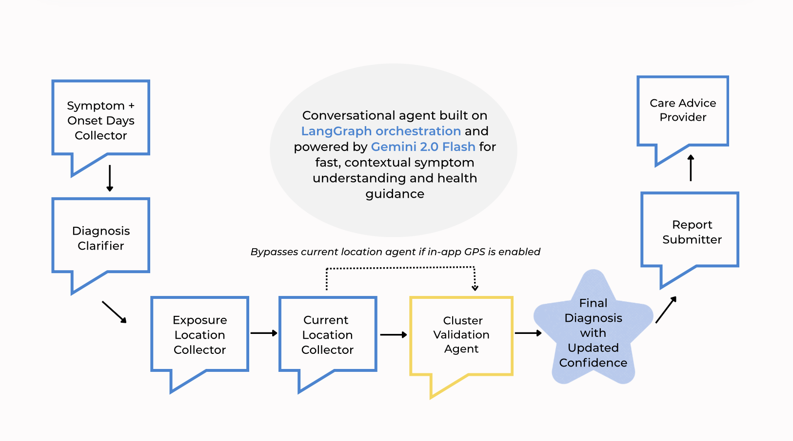

# EarlySignal: Democratizing public health through real-time community alerts

  

EarlySignal is an AI-powered mobile platform that detects emerging outbreaks by combining frontier-model diagnostic reasoning with geospatial analytics and clustering. The system collects anonymous symptoms, interprets them through a structured LLM agent, and then maps each report in both space and time using census-tract boundaries and temporal windows. By aggregating cases using clustering and comparing individual diagnoses to patterns around them, EarlySignal creates a collective medical intelligence layer that strengthens diagnostic confidence and highlights localized anomalies long before traditional surveillance systems surface them.

---

## 🛜 Table of Contents

1. [Project Motivation](#1--project-motivation)
2. [Overview of EarlySignal](#2--overview-of-earlysignal)
3. [Project](#3--project)
   - [EarlySignal Agent — Personal Health Intake and Guidance](#31--earlysignal-agent--personal-health-intake-and-guidance)
    - [Cluster Validation Agent — Collective Intelligence Layer](#311--cluster-validation-agent--collective-intelligence-layer)
   - [Alert System — Detecting Emerging Outbreaks](#32--alert-system--detecting-emerging-outbreaks)
   - [Dashboards — Seeing the Signal](#33--dashboards--seeing-the-signal)
   - [Architecture Overview](#34--architecture-overview)
4. [Evaluation & Metrics](#4-evaluation-metrics)
5. [Market Fit and Potential](#5--market-fit-and-potential)
6. [Future Works](#5--future-works)
7. [Tools Used](#6-️-tools-used)
8. [The Team Behind the App](#7--the-team-behind-the-app)

---

## 1. 🛜 Project Motivation

*Outbreaks don't start with headlines, and even experts struggling to see what's emerging before it's widespread.*

Public health signals rarely appear first in official data. By the time headlines announce a measles spike, a contaminated restaurant, or a new respiratory variant, exposure has already spread through communities. Reporting pipelines are slow, delayed, and aggregated at coarse geographic levels that hide granular neighborhood-level patterns. On top of that, in the early stages of illness, symptoms often overlap so heavily across diseases that even clinicians struggle to distinguish them without lab tests, and struggling to detect outbreaks before they're widespread.

*EarlySignal was built to bridge these gaps.*

Imagine Priya, whose child wakes up with a rash and fever, or Alex, an immunocompromised student trying to avoid respiratory outbreaks on campus. Both need timely, localized insight that goes beyond county dashboards and anecdotal guesses to protect themselves, their family, and their community. EarlySignal gives them a way to understand what’s emerging in their immediate surroundings, drawing on real-time community reports and AI-supported guidance to make informed decisions days or weeks or even months before public alerts catch up.

---

## 2. 🛜 Overview of EarlySignal

EarlySignal is organized around three core systems that work together end-to-end:

  

1. **EarlySignal Agent**
The chatbot collects symptoms, timing, and location information through a structured LLM pipeline built using Langgraph agent orchestration. During this process, a cluster-validation agent, built around the ensemble modelling framework, compares each new report with nearby cluster of cases and refines the diagnosis when strong neighborhood-level patterns appear. This is what allows the system to improve its accuracy as participation grows.

2. **Alert Engine**
All reports are mapped to census tracts and analyzed for spatial and temporal clustering. The alert engine detects anomalous concentrations of illness, identifies exposure-based clusters using DBSCAN, and evaluates whether conditions meet predefined thresholds for issuing localized alerts.

3. **Dashboards**
The aggregated data feeds into dashboards that show illness activity across tracts, cluster locations, illness category breakdowns, and recent illness trends. These dashboards give communities continuous visibility into what is circulating around them and how patterns are evolving and allows for customizable views of illness activity around them.

Together, these components turn individual reports into a real-time community health signal.

---

## 3. 🛜 Project

### 3.1 🩵 EarlySignal Agent — Personal Health Intake and Guidance

At the center of EarlySignal is a conversational agent built on *LangGraph*, a framework for structuring multi-step AI dialogues. The chatbot is powered by *Google’s Gemini 2.0 Flash* LLM model, which enables fast, contextual understanding of user symptoms and conversational health guidance. Instead of a freeform chat, the system follows a defined sequence of “agent nodes” that ensure every report is standardized, validated, and complete before it enters the analytics pipeline.

  

The conversation flow contains the following agents:

**Symptoms + Onset Days Collector**
Extracts primary symptoms, duration, and contextual details from natural language.

**Diagnosis Clarifier**
Asks targeted follow-up questions based on symptom patterns to narrow the diagnosis.

**Exposure Location Collector**
Interprets where the user believes they were exposed (e.g., “the taco place by the pier”), converting natural-language descriptions into a geocoded exposure point.

**Current Location Collector**
Captures the user’s present location (or bypasses this step if in-app GPS is enabled).

**Cluster Validation Agent**
Checks nearby cases to reinforce or correct the preliminary diagnosis.

**Report Submitter**
Packages the final structured diagnosis, symptoms, timestamps, and geolocations as a clean JSON object.

**Care Advice Provider**
Offers guidance on self-care, red-flag symptoms, and when to seek professional help.

 <video src="https://github.com/user-attachments/assets/1f42f76e-5855-4209-b902-31dfcb11ac8e" width="350" controls></video> 

At the end of the conversation, the JSON payload is written into *BigQuery* through a secure *FastAPI* endpoint. This guarantees that each report follows a consistent schema – symptoms, illness category, exposure point, current location, and confidence score – allowing downstream systems (alerts, dashboards, and clustering algorithms) to operate on high-quality, standardized data.

This pipeline allows the chatbot to serve not only as a personal triage assistant but also as a reliable data-collection interface for real-time population health intelligence.

---

### 3.1.1 🩵 Cluster Validation Agent — Collective Intelligence Layer

After the chatbot generates a preliminary diagnosis, EarlySignal runs an additional step: the **Cluster Validation Agent**. 
This mechanism is inspired by ensemble-model techniques, where many independent signals are combined to strengthen a final prediction. Here, the “ensemble” comes from real users reporting similar symptoms in the same space and time.

Instead of relying on a single user’s potentially ambiguous symptom set, the system checks whether similar illnesses are appearing across nearby reports. When multiple users independently show the same pattern within the same spatial-temporal window, that shared signal becomes a stronger basis for diagnosing emerging activity.

**How It Works**
- The system searches for clusters in the same or bordering census tracts within the past 30 days
- The system checks if the clusters detected has 4+ reports and a predominant illness
- The user’s preliminary diagnosis is compared with the cluster’s predominant illness
- Based on the level of local agreement, the diagnosis is confirmed, adjusted, or left unchanged

**Validation Outcomes**

*Confirmed Diagnosis*
If the user’s diagnosis matches the predominant illness in a nearby cluster, the system reinforces the diagnosis and boosts confidence (up to ~30%).

*Alternative Diagnosis*
If the user’s diagnosis differs from a strong cluster consensus (≥60%), EarlySignal suggests the cluster illness with higher confidence (up to ~85%).

*Weak Match*
Clusters exist, but illnesses are too mixed to infer a pattern. The diagnosis remains unchanged, but nearby illness activity is surfaced.

*No Cluster Match*
No relevant clusters found. The original diagnosis stands as-is.

By grounding each diagnosis in neighborhood-level patterns, the system becomes more accurate, adaptive, and resilient to ambiguous early symptoms. This is exactly the type of collective signal needed to spot emerging outbreaks before official data or headlines catch up.

---

### 3.2 🩵 Alert System — Detecting Emerging Outbreaks

Every report from the chatbot feeds into a unified analytical pipeline hosted in *BigQuery*. The alert engine combines neighborhood-level trends and spatial clustering to detect early signs of outbreaks and push targeted alerts to nearby users.

 <video src="https://github.com/user-attachments/assets/3dd18227-34cf-44b4-920a-b492cbd1cb8e" width="350" controls></video> 

**1. Every report becomes a data point**  
When a user completes the chatbot flow, the system logs their diagnosis, symptom set, timestamp, and approximate location in a secure dataset.

**2. Neighborhood mapping (Tract-Assigment)**  
Each report is linked to a census tract, a neighborhood-level geographic unit defined by the US Census Bureau. This allows the system to track illness activity at a more granular spatial unit than counties or ZIP codes

**3. Hotspot detection (DBSCAN Cluster-Based Alerts)**  
The system identifies groups of reports that occur close together in both space and time using a *DBSCAN (Density-Based Spatial Clustering of Applications with Noise)* algorithm. This unsupervised clustering method helps detect areas of concentrated illness activity by grouping reports and creating clusters with a minimum of 3 data points.  
- For respiratory illnesses, clusters are detected within roughly *500 meters*, since transmission risk depends on where sick individuals currently are
- For other diseases, clusters can span up to *5km to capture shared exposure sites such as restaurants, events, or pools

**4. ⁠⁠Baselines are computed within each cluster**  
Once clusters are detected, the system evaluates how current case counts compare to historical baselines for that cluster.  
This step ensures that alerts are not triggered by isolated or routine fluctuations but by genuine anomalies in disease activity.

**5. Who receives alerts (based on illness category)**
Alert routing is tailored to the mode of transmission:
- For Airborne/direct-contact illnesses (e.g., COVID-19, flu):
Alerts are based on the current location of people infected, since risk depends on proximity to contagious individuals. If multiple respiratory cases are reported near a user, the system sends a localized airborne-risk alert.
- For foodborne/waterborne/insect-borne illnesses (e.g., Salmonella, norovirus, mosquito-borne diseases):
Alerts are based on the exposure location, not where sick users are currently located. The important information is whether a restaurant, pool, grocery store, or event is linked to multiple cases.

**6. Triggering localized alerts**  
When outbreak thresholds are met, alerts are automatically issued to users whose assigned tracts overlap or are adjacent to the affected clusters.  
An alert is generated when:  
- More than *60%* of reports within a tract are diagnosed as the same disease, and 
- At least *three similar reports* are found within a single DBSCAN cluster.  

Alerts appear in the app as soon as user logs in, based on their GPS enabled geo-point that is taken in. They can also be explored on the maps in the dashboard section, making it easy for users to see affected areas and understand the underlying risk, whether that means avoiding a contaminated venue or being aware of active respiratory cases nearby.

---

### 3.3 🩵 Dashboards — Seeing the Signal

The dashboard gives users a real-time view of illness activity around them. Each component turns raw spatial data and community reports into clear, actionable visuals.

**Illness Breakdown Report**
A pie chart summarizing the distribution of active illness types within a user-defined radius. This view helps users quickly understand what categories of illness are circulating nearby, and filter by distance to adjust the level of local detail.

 <video src="https://github.com/user-attachments/assets/5a46f2dd-b381-4309-a06c-6f1108618e9d" width="350" controls></video> 

**Nearby Reports**
A map-based view showing recent reports around the user. This is especially useful for tracking airborne or direct-contact illnesses, where knowing where people currently are matters. Users can zoom in or out to explore different localities, filter by illness category, and view highlighted hotspots where community activity is elevated.

 <video src="https://github.com/user-attachments/assets/de2d76de-f528-4490-9acb-54b9662cd9ad" width="350" controls></video> 

**Exposure Sources**
This view maps the origin points of reported illnesses—where users believe they were exposed. It’s particularly valuable for foodborne, waterborne, and insect-borne illnesses, where avoiding a contaminated location is more important than knowing where sick individuals currently are. Reports can be explored across map zoom levels and filtered by illness category.

 <video src="https://github.com/user-attachments/assets/e06df7f0-2896-490c-a4d4-1e77d4daecb1" width="350" controls></video> 

Dashboards are generated dynamically from *BigQuery* through *Firebase Cloud Functions* locally in Flutter, ensuring real-time accuracy while keeping user data private and authenticated.

These dashboards give communities a clear, intuitive way to “see” the health signals emerging around them.

---

### 3.4. 🩵 Architecture Overview

The EarlySignal system integrates the mobile app, authentication layer, LLM chatbot workflow, and alert engine through a coordinated flow across **Flutter**, **Firebase**, **FastAPI**, and **BigQuery**. Below is a high-level overview of how data moves through the platform.

  

*I. User Authentication & App Initialization*

1. The user opens the EarlySignal mobile app (built in Flutter) and attempts to log in.
2. The app requests an authentication token from Firebase.
3. Firebase verifies the token and grants secure access to the rest of the system.

*II. Location Collection, BigQuery Storage & Alert Logic*

4. The app collects the user’s current GPS-enabled location geopoint.
5. This location data is sent securely to Firebase.
6. Firebase Cloud Functions pass the GPS data to BigQuery to support home page dashboard rendering and alert targeting.
7. When alerts are available, Firebase Cloud Functions fetch them from BigQuery and return them to the front end.

*III. EarlySignal Chatbot Interaction*

8. The user begins a chat session with the diagnostic agent.
9., 10. The FastAPI backend manages the full LLM workflow, including iterative symptom extraction, clarification questions, exposure information, and final diagnosis generation, along with receiving GPS-enabled location geopoint. 
11. Once the conversation is complete, the final structured report is submitted to BigQuery through FastAPI.

*IV. Dashboard Updates*

12. Firebase receives the newly submitted reports from BigQuery.
13. Dashboard views update on the front end as new reports and clusters become available.

---

## 4. 🛜 Evaluation Metrics 

EarlySignal was evaluated through *qualitative guardrails* and *quantitative testing*.

**Qualitative Validation**

| **Component** | **Description** |
|:--|:--|
| *Curated disease list* | 30+ standardized outbreak diseases across 5 transmission categories with exact naming conventions |
| *Differential diagnosis logic* | Symptom-based decision logic (e.g., fever + rash → assess rash location/distribution |
| *Uncertainty handling* | Returns “Unknown” when confidence is insufficient instead of forcing a label |
| *Spatial-temporal checks* | Diagnoses cross-referenced against active outbreak clusters in BigQuery |

**Quantitative Validation**

Synthetic outbreaks were generated across illness categories to measure accuracy on core tasks.

| **Task** | **Description** | **Accuracy** |
|:--|:--|:--|
| *Illness category classification* | Assigning the correct illness category from symptoms and clarifiers | **90%** |
| *Exposure location geocoding* | Parsing natural-language exposure descriptions into coordinates | **88%** |
| *Outbreak cluster detection* | Identifying matching spatial-temporal clusters | **95%** |
| *Outbreak cluster validation* | Confirming or revising diagnoses using nearby cluster context | **85%** |

---

## 5. 🛜 Market Fit and Potential

Traditional public health reporting is largely reactive, with data often released weekly or even biweekly.  
EarlySignal shifts this paradigm toward community-rooted, real-time detection.  

By combining peer-to-peer symptom reporting with AI-driven spatial clustering, the system surfaces emerging health signals at a fraction of the time and cost of centralized infrastructures.  

**Quantitative Comparison**

| **Metric** | **Traditional Systems (E.g. CDC,NIH)** | **EarlySignal** | **Improvement** |
|:--|:--|:--|:--|
| *Average time from symptom onset to detection* | 7–10 days | 1 day | ~85% faster |
| *Cost per case processed* | \$10–\$15 (staff + systems) | < \$0.10 (cloud compute) | ~99% cheaper |
| *Geographic precision* | County/City/State level | Census tract level | 10× finer |
| *Frequency of updates* | Weekly | Continuous | Real-time |

Even a few days of earlier awareness can translate to significant economic and health impact by reducing outbreak costs, preventing secondary cases, and enabling faster local action.

**Use Cases**

- Universities and schools monitoring campus health trends 
- Local health departments supplementing official surveillance
- NGOs or emergency teams deploying in disaster zones
- Communities tracking seasonal illnesses or post-event exposures

Comparable initiatives such as *HealthMap* and *Flu Near You* have demonstrated the power of participatory surveillance. EarlySignal builds upon these successes with AI-assisted triage, tract-level precision, and continuous data flows — offering faster, finer, and more scalable public health intelligence.

As adoption grows, anonymized data could inform early-intervention strategies, guide testing resources, and ultimately reduce outbreak impact on both local and national levels.

---

## 6. 🛜 Future Works

EarlySignal is an evolving platform, with the initial focus on biilding an accurate, efficient and technically sound illness alert system. 
The next phase includes building a dense engaged user base, partnering with health organizations, and building guardrails against bad faith actors.

**Increasing Community Engagement**

- Collaborate with universities, schools, NGOs and local health orgs to drive participation
- Badges and milestones (e.g., “Community Health Leader”) motivating users to stay engaged
  
**Partnerships**

- Test localized EarlySignal rollouts with city health offices to refine workflows and trust protocols
- Integrate verified outbreak feeds from public health departments, universities, and NGOs

**Safeguards Against Bad-Faith Reporting**

- Anomaly detection using metadata such as timestamps and location spread
- Rate-limiting and verification mechanisms to reduce spam or coordinated misuse
- Human-in-the-loop review for suspicious clusters before issuing alerts

---

## 7. 🛜 Tools Used

| **Category** | **Tools & Frameworks** |
|:--|:--|
| **Design** | Adobe Photoshop, Canva, Visio |
| **Project Management** | Trello |
| **Language** | Dart, Python, SQL, JavaScript |
| **Front-End Development** | Flutter, Google Maps SDK, Firebase Authentication |
| **Back-End Development and Deployment** | FastAPI, Firebase Cloud Functions |
| **LLM** | Gemini 2.0 Flash, LangGraph Orchestrator |
| **Data Storage** | BigQuery |
| **Visualization** | Flutter Charts and Custom Dashboards, BigQuery Views |

---

## 8. 🛜 The Team Behind the App

<table>
  <tr>
    <td></td>
    <td><a href="https://www.linkedin.com/in/mmahima"><b>Mahima Masetty</b></a></td>
  </tr>
  <tr>
    <td></td>
    <td><a href="https://www.linkedin.com/in/halleluya-mengesha"><b>Halleluya Mengesha</b></a></td>
  </tr>
  <tr>
    <td></td>
    <td><a href="https://www.linkedin.com/in/sumasreeragi"><b>Sumasree Ragi</b></a></td>
  </tr>
  <tr>
    <td></td>
    <td><a href="https://www.linkedin.com/in/hirastanley95"><b>Hira Stanley</b></a></td>
  </tr>
</table>

---

